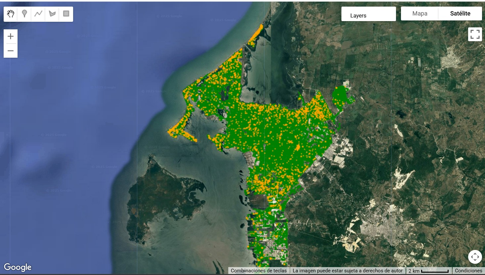
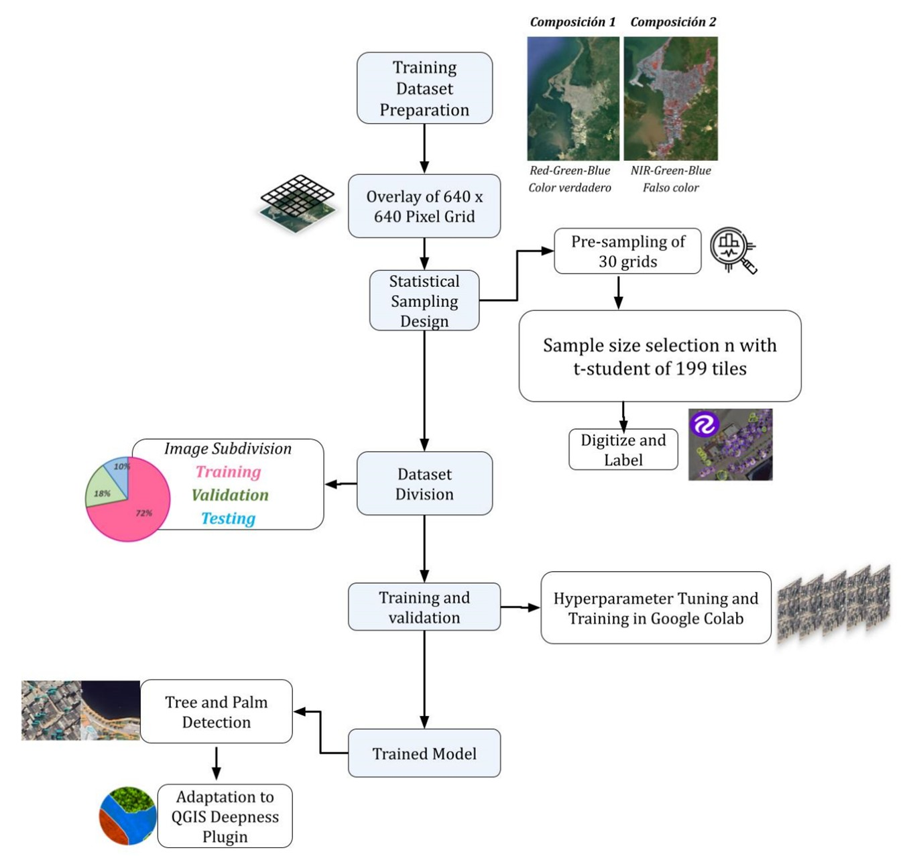
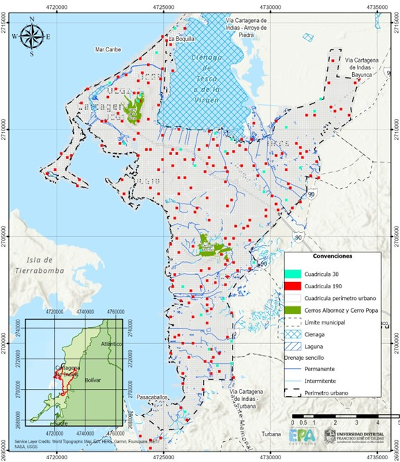
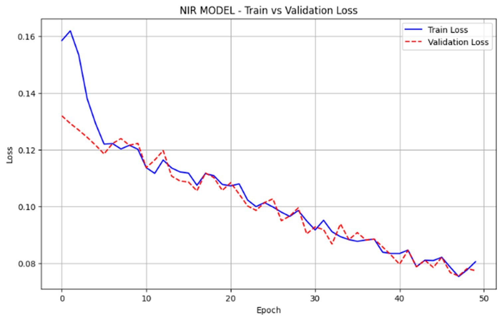
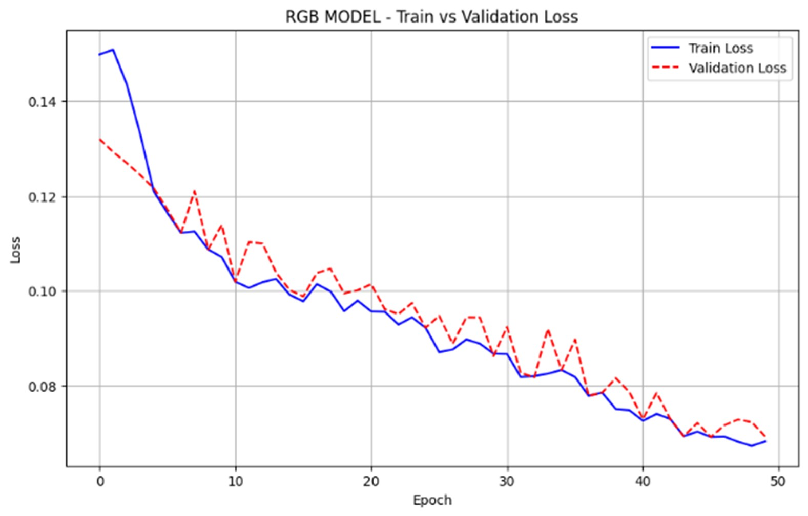
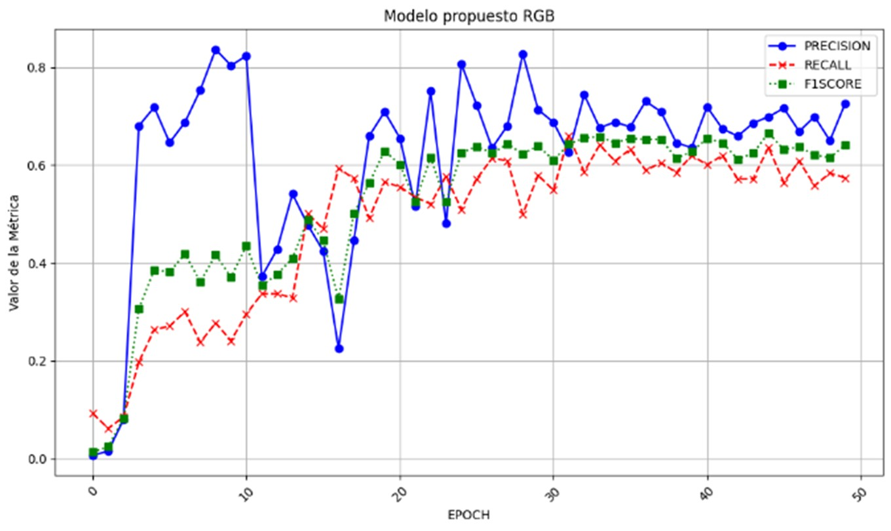
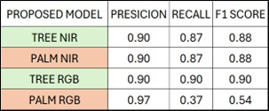
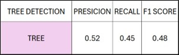

# Methodology for Urban Trees and Palms Identification using Deep Learning

## General Processing Flow

Images were processed in 5 main steps:
1. **Image Processing - Main Input**
2. **Sampling Design**
3. **Model Training, Evaluation, and Adaptation**
4. **Model Comparison**
5. **Model Adaptation to GIS Environment (QGIS/ONNX)**
6. **Results and Visualization**

## Main Input
The base input of the project consists of two orthophotos generated from images processed under strict radiometric and geometric quality controls. Radiometric control included histogram review, saturation levels (percentage of whites and blacks), as well as calculation of basic statistics such as mean and standard deviation. Additionally, tonal continuity between adjacent sheets was ensured to avoid tiling effects. Geometric control was carried out through well-defined control points, measuring the discrepancy between original coordinates and measurements on orthophotos, and calculating mean square errors in planimetry, in compliance with IGAC resolutions 471 and 529 of 2020.

The raster files used in this project are located in the [`data/raster`](./data/raster) path. These include:
- **RGB (true colors)**
- **False color (NIR in red channel), The NIR composition enhances vegetation visibility.**

## Sampling Design
- A grid of 10,679 sections of 640x640 px (57.6m x 57.6m) was overlaid.
- A random pre-sampling of 30 grids was performed to quantify trees and palms.
- It was determined that 199 sections were required to capture ecological variability.
- Labeling of 199 quadrants in Roboflow.
- Data split: 80% training (159), 20% validation (40).
- Data augmentation through saturation and rotation, resulting in 477 training images.
- Selection of 22 sections for manual testing.

## Model Training, Evaluation, and Adaptation
- Training in Google Colab using pre-trained YOLOv7.
- Hyperparameter tuning: loss function, epochs, optimizers, number of classes.
- Evaluation with metrics: precision, recall, F1-score, accuracy.
- Model conversion to ONNX format for QGIS integration (Deepness plugin).

The labels used for model training are available in the [`data/labels`](./data/labels) path, organized in subfolders for NIR and RGB:
- **COCO Format:** Compatible with YOLO models and other object detection frameworks.
- **OpenAI Format:** Useful for vision models developed in OpenAI environments.
- **TensorFlow Format:** For models developed in TensorFlow and Keras.
These labels can be reused for new training or model testing.

## Model Comparison
- Manual validation of results from three models: RGB, NIR, and ArcGIS Tree Detection.
- Construction of confusion matrix and calculation of metrics for each model.

**Analysis of graphs and results:**

The following graphs show the behavior of the models during training and validation:

- **Learning curves:** Allow observation of model performance on training and validation sets. In the case of the RGB model, possible overfitting is observed, while the NIR model shows better generalization behavior.

- **Evaluation metrics:** Present precision, recall, and F1-score values for each model. The NIR-GREEN-BLUE model is the most stable and accurate for tree and palm identification, outperforming the RGB model and ArcGIS Tree Detection model.

- **Model results:** Compare results obtained by RGB, NIR, and Tree Detection models, showing the advantages of using local data and spectral compositions adapted to the tropical environment. The NIR model allows identification of biological elements and corrects confusions present in the RGB composition.

## Results and Visualization
- Identification of 171,592 trees and 14,751 palms.
- The NIR-GREEN-BLUE model showed better precision (90%) for both vegetation types.

> By clicking on the interactive map image, you can explore in real-time the location of detected trees and palms, consult statistics, filter by vegetation type, and analyze spatial distribution. This tool allows dynamic and detailed visualization of model results, facilitating data-driven urban management and decision-making.

---

## Contact

For technical support, academic collaboration, or implementation of similar processes in other urban or forest environments, please contact:

- **Diana Millan** – [millanorduzdiana@gmail.com](mailto:millanorduzdiana@gmail.com)  
- **David Valbuena** – [dlvalbuenag@udistrital.edu.co](mailto:dlvalbuenag@udistrital.edu.co)  
- **Jaime Ussa** – [jeussag@udistrital.edu.co](mailto:jeussag@udistrital.edu.co)

---

### Usage Rights and Citation

This repository contains results from the project carried out under the agreement between Universidad Distrital Francisco José de Caldas and Empresa de Aseo de Cartagena (EPA Cartagena), in accordance with Decree 1980 of 2024 and EPA-RES-00599-2024 Resolution, which regulate the management, treatment, and use of geospatial information generated in the context of Cartagena's PGIRS.

All information contained in this repository can be freely consulted for academic, technical, and research purposes, provided it is properly cited.

**Recommended citation**:  
Ussa, J., Valbuena, D., & Millan, D. (2025). *Urban Tree Identification using AI to Optimize Maintenance and Function in Tropical Coastal Cities*. Universidad Distrital - EPA Cartagena Agreement.

This work is published under the following license:

**CC BY-NC-ND 4.0 License**  
This repository is under a Creative Commons Attribution-NonCommercial-NoDerivatives 4.0 International License. This means you can share the content (copy and redistribute the material in any medium or format) as long as you:

- Give appropriate credit.
- Do not use it for commercial purposes.
- Do not create derivative works.

For different uses, explicit authorization from the authors must be obtained.
