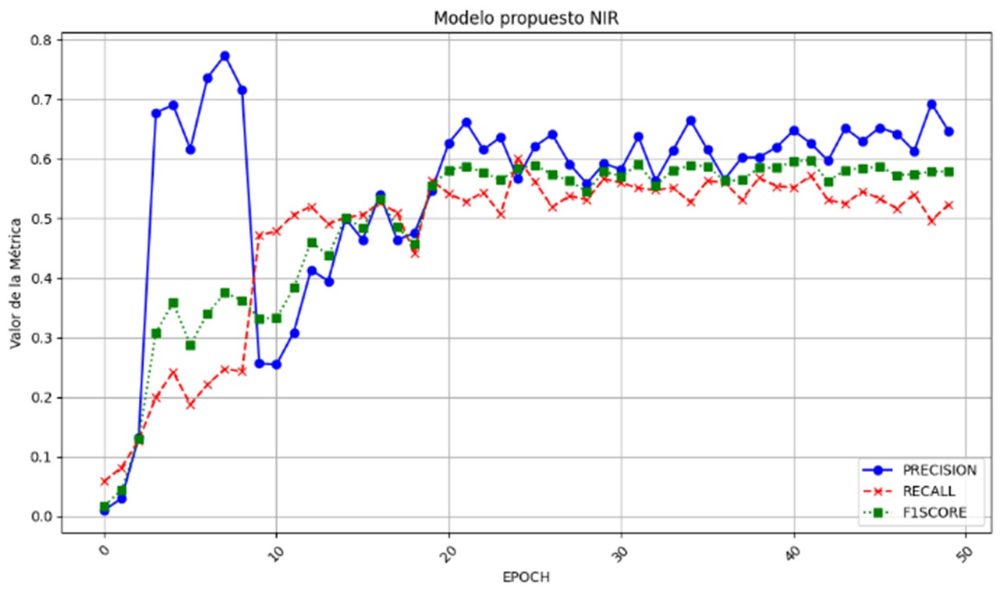

# Metodología para la Identificación de Árboles y Palmas Urbanas mediante Deep Learning

## Flujo General de Procesamiento

Las imágenes se procesaron en 5 pasos principales:
1. **Procesamiento de la imagen - Insumo Principal**
2. **Diseño de Muestreo**
3. **Entrenamiento, Evaluación y Adaptación del Modelo**
4. **Comparación de Modelos**
5. **Adaptación del modelo al entorno SIG (QGIS/ONNX)**
6. **Resultados y Visualización**

## Insumo Principal
El insumo base del proyecto corresponde a dos ortofotos generadas a partir de imágenes procesadas bajo estrictos controles de calidad radiométrica y geométrica. El control radiométrico incluyó la revisión de histogramas, niveles de saturación (porcentaje de blancos y negros), así como el cálculo de estadísticas básicas como la media y la desviación estándar. Además, se garantizó la continuidad tonal entre hojas adyacentes para evitar efectos de teselado. Por su parte, el control geométrico se llevó a cabo mediante puntos de control bien definidos, midiendo la discrepancia entre coordenadas originales y medidas sobre las ortofotos, y calculando errores medios cuadrados en planimetría, en cumplimiento con las resoluciones 471 y 529 de 2020 del IGAC.

Los archivos ráster utilizados en este proyecto se encuentran en la ruta [`data/raster`](./data/raster). Estos incluyen:
- **RGB (colores verdaderos)**
- **Falso color (NIR en el canal rojo), La composición NIR realza la visibilidad de la vegetación.** 

## Diseño de Muestreo
- Se superpuso una rejilla de 10,679 secciones de 640x640 px (57,6m x 57,6m).
- Se realizó un pre-muestreo aleatorio de 30 rejillas para cuantificar árboles y palmas.
- Se determinó que se requerían 199 secciones para capturar la variabilidad ecológica.
- Etiquetado de 199 cuadrantes en Roboflow.
- División de datos: 80% entrenamiento (159), 20% validación (40).
- Aumento de datos mediante saturación y rotación, resultando en 477 imágenes para entrenamiento.
- Selección de 22 secciones para pruebas manuales.

## Entrenamiento, Evaluación y Adaptación del Modelo
- Entrenamiento en Google Colab usando YOLOv7 preentrenado.
- Ajuste de hiperparámetros: función de pérdida, épocas, optimizadores, número de clases.
- Evaluación con métricas: precisión, recall, F1-score, accuracy.
- Conversión del modelo a formato ONNX para integración con QGIS (Deepness plugin).

Las etiquetas utilizadas para el entrenamiento de los modelos están disponibles en la ruta [`data/labels`](./data/labels), organizadas en subcarpetas para NIR y RGB:
- **Formato COCO:** Compatible con modelos YOLO y otros frameworks de detección de objetos.
- **Formato OpenAI:** Útil para modelos de visión desarrollados en entornos OpenAI.
- **Formato TensorFlow:** Para modelos desarrollados en TensorFlow y Keras.
Estas etiquetas pueden ser reutilizadas para nuevos entrenamientos o pruebas de modelos.

## Comparación de Modelos
- Validación manual de resultados de tres modelos: RGB, NIR y Tree Detection de ArcGIS.
- Construcción de matriz de confusión y cálculo de métricas para cada modelo.

**Análisis de las gráficas y resultados:**

Las siguientes gráficas muestran el comportamiento de los modelos durante el entrenamiento y validación:

- **Curvas de aprendizaje:** Permiten observar el rendimiento del modelo en el conjunto de entrenamiento y validación. En el caso del modelo RGB, se observa un posible overfitting, mientras que el modelo NIR muestra un mejor comportamiento generalizado.

- **Métricas de evaluación:** Se presentan los valores de precisión, recall y F1-score para cada modelo. El modelo NIR-GREEN-BLUE es el más estable y preciso para la identificación de árboles y palmas, superando al modelo RGB y al modelo Tree Detection de ArcGIS.

- **Resultados de los modelos:** Se comparan los resultados obtenidos por los modelos RGB, NIR y Tree Detection, evidenciando las ventajas de utilizar datos locales y composiciones espectrales adaptadas al entorno tropical. El modelo NIR permite identificar elementos biológicos y corrige confusiones presentes en la composición RGB.

## Resultados y Visualización
- Identificación de 171,592 árboles y 14,751 palmas.
- El modelo NIR-GREEN-BLUE mostró mejor precisión (90%) para ambos tipos de vegetación.

> Al hacer clic en la imagen del mapa interactivo, podrás explorar en tiempo real la ubicación de los árboles y palmas detectados, consultar estadísticas, filtrar por tipo de vegetación y analizar la distribución espacial. Esta herramienta permite una visualización dinámica y detallada de los resultados del modelo, facilitando la toma de decisiones y la gestión urbana basada en datos.

---

## Contacto

Para soporte técnico, colaboración académica o implementación de procesos similares en otros entornos urbanos o forestales, por favor contacte a:

- **Diana Millan** – [millanorduzdiana@gmail.com](mailto:millanorduzdiana@gmail.com)  
- **David Valbuena** – [dlvalbuenag@udistrital.edu.co](mailto:dlvalbuenag@udistrital.edu.co)  
- **Jaime Ussa** – [jeussag@udistrital.edu.co](mailto:jeussag@udistrital.edu.co)

---

### Derechos de uso y citación

Este repositorio contiene resultados del proyecto realizado en el marco del convenio entre la Universidad Distrital Francisco José de Caldas y la Empresa de Aseo de Cartagena (EPA Cartagena), conforme al Decreto 1980 de 2024 y la Resolución EPA-RES-00599-2024, que reglamentan el manejo, tratamiento y uso de la información geoespacial generada en el contexto del PGIRS de Cartagena.

Toda la información contenida en este repositorio puede ser consultada libremente para fines académicos, técnicos y de investigación, siempre y cuando se cite adecuadamente.

**Citación recomendada**:  
Ussa, J., Valbuena, D., & Millan, D. (2025). *Identificación de árboles urbanos mediante IA para optimizar su mantenimiento y función en ciudades tropicales costeras*. Convenio Universidad Distrital - EPA Cartagena.

Este trabajo está publicado bajo la siguiente licencia:

**Licencia CC BY-NC-ND 4.0**  
Este repositorio se encuentra bajo una Licencia Creative Commons Atribución-NoComercial-SinDerivadas 4.0 Internacional. Esto implica que puedes compartir el contenido (copiar y redistribuir el material en cualquier medio o formato) siempre que:

- Des crédito apropiado.
- No lo utilices para fines comerciales.
- No generes obras derivadas.

Para usos distintos, debe obtenerse una autorización explícita de los autores.
